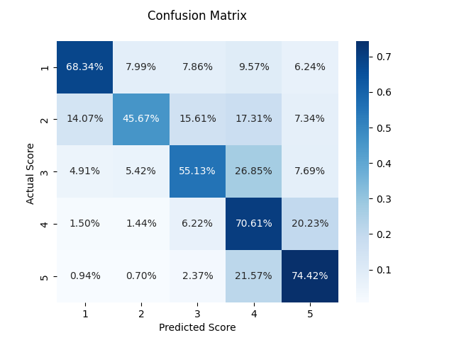

# AmazonReview_pyspark
Integrating pyspark and sqlite3 to predict a score for amazon products using users reviews
## Content
- [Prerequisites](#prerequisites)
- [Installation](#installation)
- [Structure](#structure)
- [Preprocessing](#preprocessing)
- [Training](#training)
- [Evaluation](#evaluation)
- [Prediction](#prediction)

## Prerequisites
- Ubuntu >= 18.04
- Python > 3.8
- Anaconda3

## Installation
- To setup and activate a conda environment with our needed libraries follow the next steps:
```
conda create -n pyspark python=3.9 -y
conda install openjdk
conda activate pyspark
sudo apt-get install sqlite3
pip install matplotlib seaborn
```

## Structure
- [train.py](train.py): This script loads sqlite3 database, preprocessing the data using queries, train logistic regression with gridsearch and cross-validation, evaluate the model on test set and save the report. Script takes the following arguemnts:           
`SQLdatabase_path`: Path to sqlite3 database.<br>
`model_path`: Path to dump output model.<br>
`report_path`: Path to output directory where you will find report file and confusion matrix plot<br>

- [predict.py](predict.py): This script loads sqlite3 database and output CSV file containing the result, Script takes the following arguemnts:             
`SQLdatabase_path`: Path to sqlite3 database.               
`model_path`: Path to trained model.                
`output_csv_path`: output CSV path which contains the prediction results.              

## Preprocessing
- Amazon review database was used for training and evaluation.
- Single query was created to retrieve preprocessed data
- I retrieve specific columns related to our task.
- All columns were casted to either string or float types based on their content.
- NULL rows were removed.
- Rows with `HelpfulnessNumerator` >=` HelpfulnessDominator` were retrieved
- The desired features were `Summary` and `Text`.
- They were concatenated into one column, tokenized, cleaned of stop words, then vectorized.
- The dataset were found to be very unbalanced, especially score 5.0
- I only retrieved 200000 columns after ordering by Score ascendingly, i found this will balance the dataset
- You can find detailed steps inside [train.py](train.py) script.

## Training
- Retrieved data were inserted into pyspark dataframe
- Logistic regression model was trained on this data.
- I used grid search with cross-validation to optimize the model
- You can use this model to predict the score.

## Evaluation
- The dataset was split into 75% train set and 25% test set.
- Evaluating the model on test set got me the following result:              

|  | **Precision** | **Recall** | **F1-score** |
| ------ | ------ | ------ | ------ |
| 1.0 | 0.741 | 0.683 | 0.711 |
| 2.0 | 0.614 | 0.457 | 0.524 |
| 3.0 | 0.607 | 0.551 | 0.578 |
| 4.0 | 0.639 | 0.706 | 0.671 |
| 5.0 | 0.727 | 0.744 | 0.735 |
| **Accuracy** | 0.674 | 0.674 | 0.674 |
| **Weighted-Avg** | 0.673 | 0.674 | 0.671 |
- **Confusion matrix**:                        


## Prediction
- To predict new scores given a database file use [predict.py](predict.py), where it will read the SQL database file and produce scores.
- Scores will be saved to csv file.
